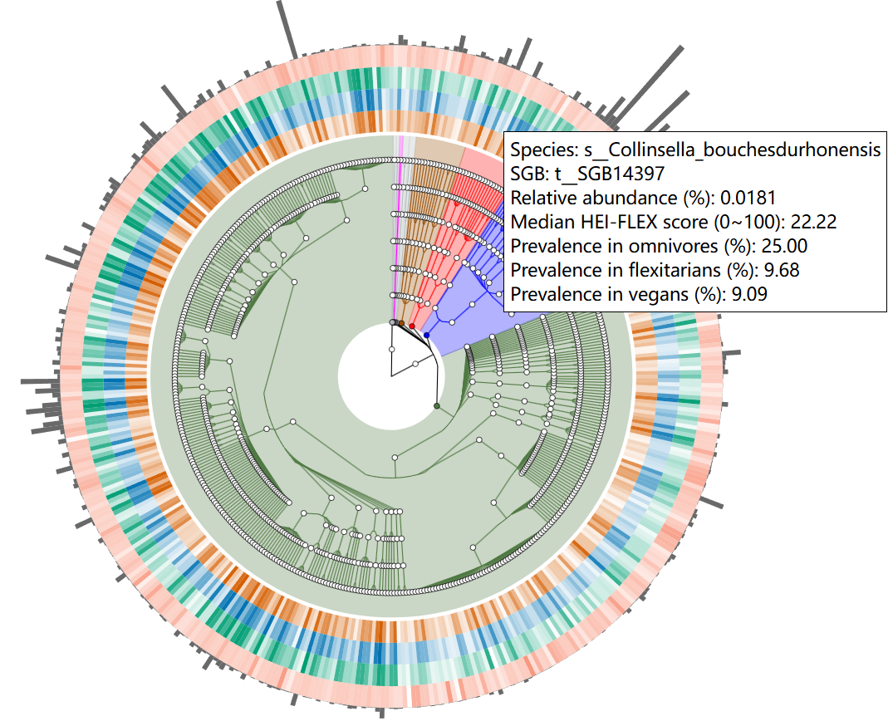

# Graphlan All Species

This project provides a data visualization interface for **graphlan_all_species**, implemented using HTML and JavaScript. It is designed to display key species-related data metrics in an intuitive format.

## Visit 
[https://hoshigawarei.github.io/graphlan_all_species/]

## Displayed content includes:
- **Species**: Species name
- **SGB**: Species-level genome bin
- **Relative abundance (%)**: Relative abundance (percentage)
- **Median HEI-FLEX score (0~100)**: Median HEI-FLEX score (0 to 100)
- **Prevalence in omnivores (%)**: Prevalence in omnivores (percentage)
- **Prevalence in flexitarians (%)**: Prevalence in flexitarians (percentage)
- **Prevalence in vegans (%)**: Prevalence in vegans (percentage)

Users can interact with the visualization to explore various species and their associated data metrics, facilitating in-depth analysis of species distribution and abundance across different dietary patterns.

## Example Interface

---------------------------------------------------------------------------------------------------------------------------

该项目通过前端Web技术（基于HTML和JavaScript）展示了 **graphlan_all_species** 的数据可视化，旨在直观呈现物种与其相关的多项数据指标。

## 访问链接
[https://hoshigawarei.github.io/graphlan_all_species/]

## 显示内容包括:
- **Species**: 物种名称
- **SGB**: 物种分类群
- **Relative abundance (%)**: 相对丰度（百分比）
- **Median HEI-FLEX score (0~100)**: 健康饮食指数-弹性素食中位数得分（0到100）
- **Prevalence in omnivores (%)**: 杂食者中的流行率（百分比）
- **Prevalence in flexitarians (%)**: 弹性素食者中的流行率（百分比）
- **Prevalence in vegans (%)**:  纯素食者中的流行率（百分比）

用户可以通过动态交互查看不同物种及其各类数据指标，帮助深入分析各类饮食模式下物种的分布与丰度。

